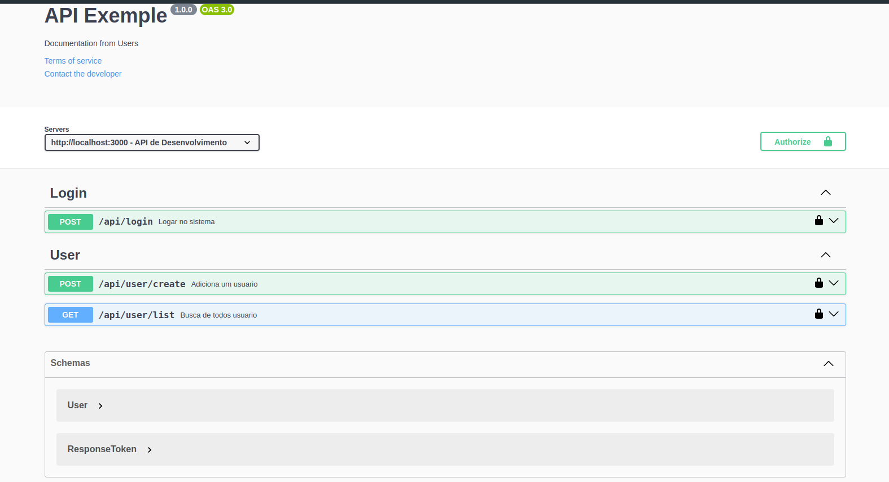
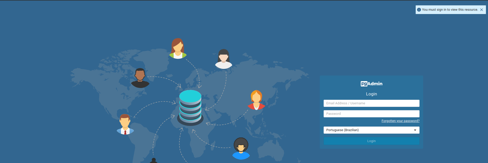
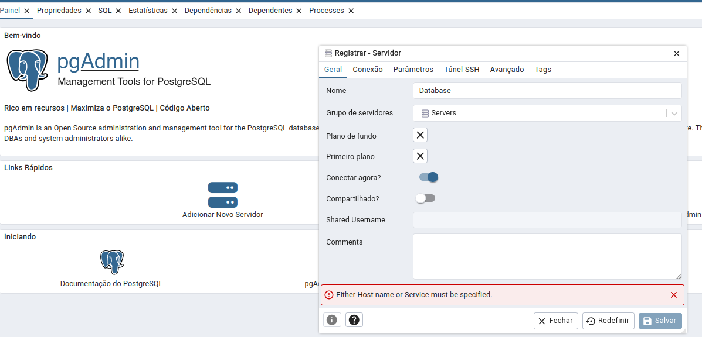
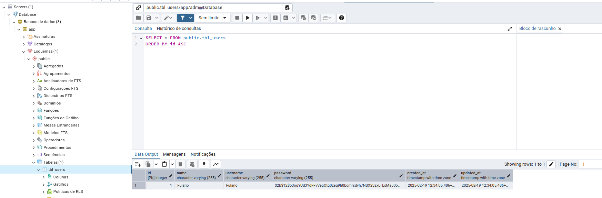

# API de Login

### - clean architecture

- Single Responsiblity Principle (Princípio da responsabilidade única)
- Open-Closed Principle (Princípio Aberto-Fechado)
- Liskov Substitution Principle (Princípio da substituição de Liskov)
- Interface Segregation Principle (Princípio da Segregação da Interface)
- Dependency Inversion Principle (Princípio da inversão da dependência)


### Requisitos
- docker
- docker-compose

#### Rodar aplicação
```bash
  docker-compose up -d
```

```bash
  docker-compose exec postgres psql -U adm -d app
```
dentro do container copie e cole o comando abaixo
```bash
    CREATE TABLE IF NOT EXISTS tbl_users (
    id SERIAL PRIMARY KEY,
    name VARCHAR(255) NOT NULL,
    username VARCHAR(255) UNIQUE NOT NULL,
    password VARCHAR(255) NOT NULL,
    created_at TIMESTAMPTZ DEFAULT NOW(),
    updated_at TIMESTAMPTZ DEFAULT NOW()
);
```
para sair do container
```bash
    exit
```
[Clean Arch Swagger](http://localhost:3000/docs)


[PgAdmin](http://localhost:8082/login?next=/browser/)
```bash
    email: admin@adm.com
    password: adm
```


#### Configurar conexão
- Geral -> name = Database

- Conexão -> Hostname = postgres
- Conexão -> username = adm
- Conexão -> password = adm
- Salvar


